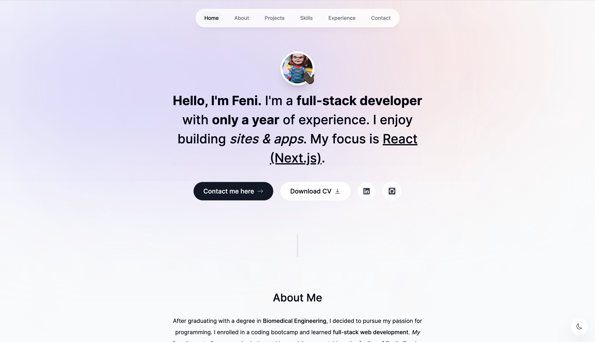

# Portfolio
------------

------------

## Introduction
This is an elegant portfolio website showcasing my credentials using the latest web development technologies around. 
It's built on the [React](https://react.dev)[/]()[NextJS](https://nextjs.org/) framework and hosted via [Vercel](https://vercel.com/).

## Development

### Setup 

- Add `RESEND_API_KEY` environment variable in `.env.local`
- In the `send-email.ts` action file, change the "to" email to your own email

### Packages
During development, install the following packages using the package manager of your choice.
>**_Caution_**
Try not to use different package managers for the client and server sides of the app. Stick to one, at most.
~~~
    @react-email/components
	@react-email/tailwind
	@types/node
	@types/react
	@types/react-dom
	autoprefixer
	clsx
	eslint
	eslint-config-next
	framer-motion
	next
	postcss
	react
	react-dom
	react-hot-toast
	react-icons
	react-intersection-observer
	react-vertical-timeline-component
	resend
	tailwindcss
	typescript
~~~

## Credits

All Credit 👏🏾 goes to ***ByteGrad*** for building the original app on which I based mine off of; it's exactly the same with some minor changes. Here's his a [link](http://www.youtube.com/@ByteGrad) to his channel for more content in case you're curious.
To see the code base for the original app, here's the link to the github [repo](https://github.com/ByteGrad/portfolio-website.git). Make sure to leave a star.
In addition, watch the youtube [tutorial](https://youtu.be/sUKptmUVIBM) and don't forget to like it if you do.

  